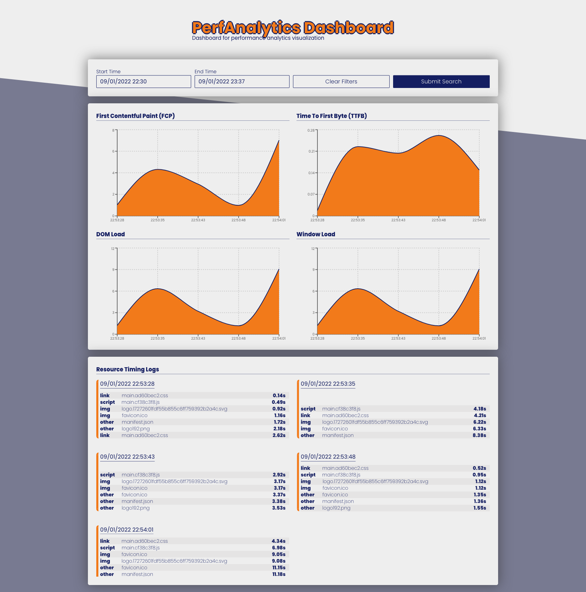
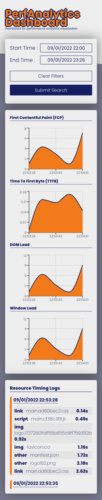
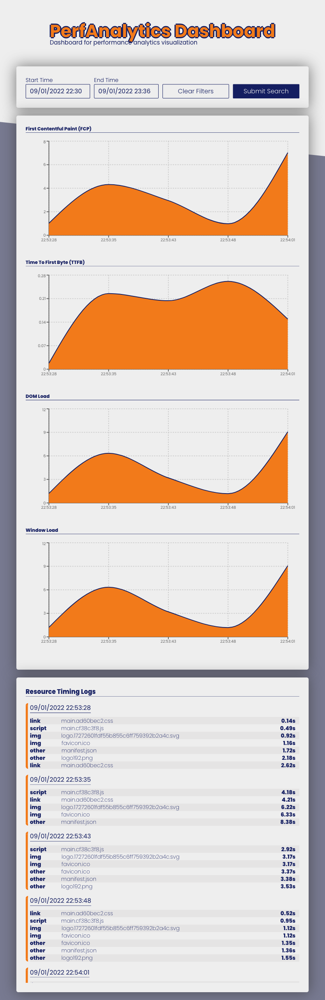

# PerfAnalytics App

Dashboard for performance analytics visualization.

PerfAnalytics is an ecosystem which collects and criticizes web performance data. The ecosystem consists of 3 subsystem;
- **perf-analytics-lib.js**

  A plug-and-play, cross-browser compatible and lightweight library for collecting and providing web performance data to a related API in kind of web apps.
  #### Usage/Examples

  ```html
  <html lang="en">
    <head>
      <script src="https://app-perf-analytics.herokuapp.com/perf-analytics-lib.js"></script>
      <script>
        PerfAnalyticsLib.initializeAnalyticsLib("<DESTINATION_API_URL>");
      </script>
    </head>
  </html>
  ```
- **app-perf-analytics**

  A restful API which saves data, posted from **perf-analytics-lib.js** and returns time specific filtered data. And the other client apps also serving over this API's specific routes.
- **app-perf-analytics-dashboard-client**

  A dashboard which shows perf related metrics in a visualized way.
- **app-perf-analytics-data-provider-client**

  A client app for importing **perf-analytics-lib.js** and providing browser metrics data to related service with this.

## 🛠 Tech stack

<a href="https://nodejs.org/" title="Node.js"></a>
<a href="https://developer.mozilla.org/en-US/docs/Web/JavaScript" title="JavaScript"></a>
<a href="https://reactjs.org/" title="React"></a>
<a href="https://www.mongodb.org/" title="MongoDB"></a>
<a href="https://www.npmjs.com/" title="npm"></a>
<a href="https://webpack.js.org/" title="webpack"></a>
<a href="https://babeljs.io/" title="Babel"></a>
<a href="https://eslint.org/" title="ESLint"></a>
<a href="https://prettier.io/" title="Prettier"></a>
<a href="https://jestjs.io/" title="Jest"></a>
<a href="https://sass-lang.com/" title="Sass"></a>
<a href="https://www.docker.com/" title="docker"></a>
<a href="https://git-scm.com/" title="Git"></a>

## Deployment

This project has an automated deploy mechanism. After all merges to **master** branch, the auto-deploy mechanism is going to be triggered
At the same time, there is also an automated-testing process is exist. Like deploy mechanism, this test process is going to be triggered immediately after master merges, too.

**CI** : Github Actions

**CD** : Heroku


## Demo

Dashboard Client App : https://app-perf-analytics.herokuapp.com

Data Provider Client App : https://app-perf-analytics.herokuapp.com/data-provider-client


## Run Locally

### Create an image and launch in a container via Docker

Build and launch all services in detached mode

```bash
  docker-compose up -d
```

### Manually Launch The Project

Clone the project

```bash
  git clone https://github.com/cantanert/app-perf-analytics.git
```

Go to the project directory

```bash
  cd app-perf-analytics
```

Install all packages

```bash
  npm run install:all-packages
```

Build all packages

```bash
  npm run build:all-packages
```

Start the server

```bash
  npm run start:express
```


## Running Tests

To run tests for all packages, just run the following command

```bash
  npm run test
```


## Environment Variables

To run this project locally, you will need to add the following environment variables to your .env file

`MONGO_ATLAS_USERNAME`

`MONGO_ATLAS_PASSWORD`

`MONGO_ATLAS_ADDRESS`


## API Reference

#### Get data for the last half hour

```http
  GET /api/performance-metrics-query
```


#### Get data for the filtered date range

```http
  POST /api/performance-metrics-query
```

| Body Parameter | Type     | Description                       |
| :-------- | :------- | :-------------------------------- |
| `startDate`      | `String` | **Required**. Start date filter for query. |
| `endDate`      | `String` | **Required**. End date filter for query. |

#### Send data to save

```http
  POST /api/performance-metrics-capability
```

| Body Parameter | Type     | Description                       |
| :-------- | :------- | :-------------------------------- |
| `TTFB`      | `Number` | **Required**. Time To First Byte metric |
| `FCP`      | `Number` | **Required**. First Contentful Paint metric |
| `WINDOW_LOAD`      | `Number` | **Required**. loadEventEnd metric |
| `DOM_LOAD`      | `Number` | **Required**. domComplete metric |
| `RESOURCES`      | `Array` | **Required**. An array of name, initiatorType, responseEnd and date metrics |
| `dateInfo`      | `String` | **Required**. The date info that the request triggered |

#### app-perf-analytics-dashboard-client

```http
  GET /
```

#### perf-analytics-lib.js

```http
  GET /perf-analytics-lib.js
```

#### app-perf-analytics-data-provider-client

```http
  GET /data-provider-client
```

## Color Reference

| Color      | Hex                                                                |
|------------| ------------------------------------------------------------------ |
| $palette-1 |  #EEEEEE |
| $palette-2 |  #787A91 |
| $palette-3 |  #141E61 |
| $palette-4 |  #f27a1a |


## Authors

- [@cantanert](https://www.github.com/cantanert)

## 📷 Screenshots

###Desktop


###Mobile


###Tablet

